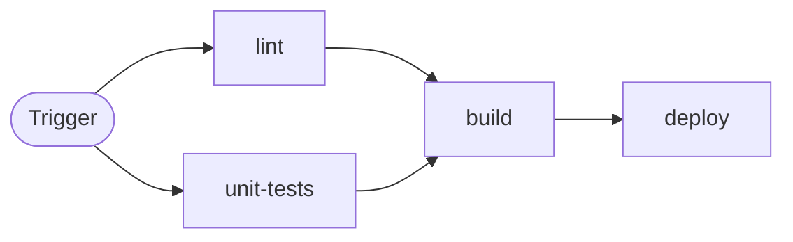

# Workflow Metrics

[](https://github.com/djdiptayan1/workflow-metrics/actions/workflows/ci.yml)
[](LICENSE)

An open-source dashboard for GitHub Actions metrics with AI-powered optimization suggestions.


## Features

- **Read-only GitHub OAuth login** — Sign in with GitHub using `repo` and `read:org` scopes to read repositories, Actions data, pull requests, and logs; the app does not write to repositories
- **Repository overview dashboard** — Total runs, success rate, average duration, build minutes, skip rate, and DORA metrics across a selectable Actions history window
- **DORA metrics** — Deployment Frequency, Lead Time for Changes, Change Failure Rate, and Mean Time to Recovery over the last 30 days
- **Run history + workflow-change markers** — Visual breakdown of success/failure/cancelled runs plus commit markers when workflow files changed
- **Duration by workflow** — Bar chart comparing average duration across all workflows
- **Build minutes + billable minutes** — Raw build minutes with billable estimate using GitHub-hosted runner multipliers (Linux ×1, Windows ×2, macOS ×10)
- **Minutes analytics** — Minutes by workflow, daily build-minutes trend, per-workflow minutes by job, and daily workflow minutes trend
- **Efficiency insights** — Wasted minutes on failures, most expensive workflow, costliest branch, and frequency × duration table
- **Skip analytics** — Global skip rate, per-workflow skip rate, and top skipped workflows table
- **Recent runs table** — Paginated history of every imported run with status, branch, actor, duration, and direct in-app investigation links
- **Workflow inventory** — Search every workflow, pin important ones, classify production/development workflows, see total run counts, and surface the latest failure prominently
- **Workflow detail dashboard** — Deep dive into a single workflow: P50/P95 duration, build minutes, billable minutes, skip rate, and cost efficiency
- **Workflow structure flow chart** — Interactive workflow graph (trigger + job dependency DAG) with runner labels and step counts
- **Job + step breakdowns** — Per-job timing analysis (avg/min/max) and slowest-job step-level breakdown from recent completed runs
- **Run failure investigation** — Open any run inside the app to inspect failed jobs and steps, copy the full GitHub log, and generate an AI explanation with commit/PR attribution and suggested next actions
- **Workflow file preview** — Inspect workflow YAML from the workflow detail page without leaving the dashboard
- **Pull request workspace** — Cursor-paginate complete open, closed, and merged PR history; filter the current page by PR number or title; view changed LOC and the latest status of each associated GitHub Action
- **AI optimization and failure analysis** — Use configured OpenAI, Google Gemini, or Mistral models for streaming workflow suggestions and evidence-based failure explanations
- **Settings page** — Manage GitHub connections, tracked repositories, AI provider/model, Actions history, dashboard refresh policy, and theme
- **Performance-aware caching** — Derived dashboard snapshots are cached with a user-selectable realtime, 5-, 10-, or 15-minute refresh policy; stale snapshots refresh in the background
- **Dark / light mode** — Dark by default, persisted per user preference

## Data freshness, caching, and pagination

### Workflow runs and metrics

Workflow-run data and derived dashboard/workflow snapshots are stored in Redis, isolated by user,
repository, and 7/30/90/all-history lookback. The refresh setting is a freshness policy, not browser
polling.

| Cache condition                    | What the user receives                                 | GitHub workflow-run requests                                   |
| ---------------------------------- | ------------------------------------------------------ | -------------------------------------------------------------- |
| Fresh snapshot                     | Redis snapshot immediately                             | None                                                           |
| Stale snapshot                     | Existing snapshot immediately                          | One lock-protected incremental refresh runs in the background  |
| First load                         | Progress stream while all selected history is imported | Paginated until GitHub returns the end of the selected history |
| Redis unavailable with no snapshot | Retryable `503`                                        | No unbounded fallback import                                   |

Changing screens may call the application API again, but it does not repaginate GitHub runs while
the snapshot is fresh. `realtime` permits a refresh on each visit; the other settings keep snapshots
fresh for 5, 10, or 15 minutes. A weekly reconciliation catches older reruns or deletions. Responses
include `X-Data-Cache` and `X-Data-Sync` headers for diagnosis. Workflow-file hits and known-missing
files are cached for one hour.

### Pull requests

Pull requests use GitHub GraphQL cursor pagination with page sizes of 20, 50, or 100. Open,
closed-unmerged, and merged counts are returned separately, and pagination can traverse the complete
repository history without loading the full collection into the browser or using GitHub Search's
1,000-result window. Opening the PR screen, changing a tab, or moving page fetches only that page.

### Duration data quality

Every duration-based surface uses the same effective completion time: repository/workflow averages,
P50/P95, trends, recent runs, build and wasted minutes, daily minutes, lead time, and MTTR. A completed
run whose listing timestamps exceed GitHub's 35-day workflow limit is repaired from its matching
workflow-attempt timestamps. If repair fails, the run remains in counts and rates but is excluded
from time calculations; the UI reports the excluded count instead of publishing a corrupted value.
Durations within the documented limit are retained; the application does not invent replacement
values or clamp legitimate long-running workflows.

## Workflow Flow Chart

Workflow detail pages include an interactive flow chart that visualizes trigger-to-job execution order and `needs` dependencies.



## Tech Stack

- **Framework**: Svelte 5 + SvelteKit 2
- **Styling**: TailwindCSS 4 + `@tailwindcss/vite`
- **Auth & Database**: Supabase (GitHub OAuth + PostgreSQL)
- **GitHub API**: `@octokit/rest`
- **AI**: Vercel AI SDK + OpenAI, Google Generative AI, and Mistral providers (streaming)
- **Runtime**: Node.js 24 via `@sveltejs/adapter-node`, Docker Compose, and Redis 8
- **Package manager**: PNPM

## Design

The UI design and color system are inspired by the free template **"Dark Admin Dashboard"** by [Malik Ali](https://www.figma.com/@malik_ali).  
Figma template: [Dark Admin Dashboards](https://www.figma.com/community/file/1325597018063319916/free-dark-admin-dashboards).

## Getting Started

Want to run everything locally (local Supabase, not a hosted project) with full step-by-step
instructions, including GitHub OAuth App setup and Docker networking notes? See
[LOCAL_SETUP.md](LOCAL_SETUP.md).

The instructions below assume a hosted Supabase project instead.

### Run locally with Docker

1. Copy `.env.example` to `.env` and add the Supabase values plus the server-only `SECRETS_ENCRYPTION_KEY`:

   ```bash
   cp .env.example .env
   ```

2. Build the local source and start the app plus its private Redis service:

   ```bash
   CI_OBSERVE_IMAGE=workflow-metrics:local docker compose up -d --build
   docker compose ps
   ```

3. Open http://localhost:3000.

The database migrations in `supabase/migrations/` must be applied to the connected Supabase project
before signing in. Configure GitHub OAuth with `http://localhost:3000/auth/callback` as its local
redirect URL.

### Prerequisites

- Node.js >= 24
- PNPM >= 10

### 1. Clone and install

```bash
git clone https://github.com/djdiptayan1/workflow-metrics.git
cd workflow-metrics
pnpm install
```

### 2. Create a Supabase project

1. Create a new project at [supabase.com](https://supabase.com).
2. **Run database migrations** (choose one method):
   - **With Supabase CLI:**
     ```bash
     supabase link --project-ref YOUR_PROJECT_REF
     supabase db push
     ```
     Your project ref is in the Supabase dashboard URL: `https://supabase.com/dashboard/project/YOUR_PROJECT_REF`.
   - **Without CLI:** In **Supabase Dashboard → SQL Editor**, run every file in `supabase/migrations/` in numeric order. For an existing deployment with plaintext credentials, follow the staged `021` → migration script → `022` sequence in [Local setup: migrate existing credentials](LOCAL_SETUP.md#migrate-existing-credentials) instead of applying `022` immediately.
3. **Enable GitHub OAuth:**
   - Go to [GitHub → Settings → Developer settings → OAuth Apps → New OAuth App](https://github.com/settings/applications/new).
   - Set **Authorization callback URL** to your Supabase callback: `https://<your-project-ref>.supabase.co/auth/v1/callback`.
   - Copy the **Client ID** and **Client secret**, then in **Supabase → Authentication → Providers → GitHub**, paste them and enable GitHub.
   - In **Supabase → Authentication → URL Configuration → Redirect URLs**, add:
     ```
     http://localhost:5173/auth/callback
     https://metrics.example.com/auth/callback
     ```
4. From **Supabase → Project Settings → API**, copy:
   - **Project URL** → `PUBLIC_SUPABASE_URL`
   - **anon / public** key → `PUBLIC_SUPABASE_ANON_KEY`
   - **service_role** key → `SUPABASE_SERVICE_ROLE_KEY` _(server-only; never expose it to the browser or commit it)_

### 3. Configure an AI provider (optional)

AI optimization and failure analysis use a per-user OpenAI, Gemini, or Mistral API key configured in the app Settings page. The key is not a server environment variable.

1. Create an API key with your selected provider: [OpenAI](https://platform.openai.com/api-keys), [Google AI Studio](https://aistudio.google.com/app/apikey), or [Mistral AI](https://console.mistral.ai/api-keys).
2. After logging into the app, open **Settings**, choose the provider/model, and paste the key.

The key is stored encrypted in Supabase and is only used server-side. AI features are unavailable without one; the rest of the app works normally.

### 4. Configure environment variables

Copy `.env.example` to `.env`:

```bash
cp .env.example .env
```

Fill in the values:

```env
# ── Supabase ──────────────────────────────────────────────────────────────────
PUBLIC_SUPABASE_URL=https://your-project.supabase.co
PUBLIC_SUPABASE_ANON_KEY=your-anon-key
SUPABASE_SERVICE_ROLE_KEY=your-service-role-key
REDIS_URL=redis://localhost:6379

# ── App URL (production only) ─────────────────────────────────────────────────
# Required in production so OAuth redirects back to the correct URL.
# Leave commented out for local dev — the app uses the request origin automatically.
# PUBLIC_APP_URL=https://metrics.example.com

# ── Credential encryption (server-only) ───────────────────────────────────────
# Generate with: node -e "console.log(require('node:crypto').randomBytes(32).toString('base64url'))"
SECRETS_ENCRYPTION_KEY=your-base64url-encoded-32-byte-key
```

| Variable                    | Required          | Description                                                                                             |
| --------------------------- | ----------------- | ------------------------------------------------------------------------------------------------------- |
| `PUBLIC_SUPABASE_URL`       | Yes               | Supabase project URL                                                                                    |
| `PUBLIC_SUPABASE_ANON_KEY`  | Yes               | Supabase anon (public) key                                                                              |
| `SUPABASE_INTERNAL_URL`     | Docker local only | Container-reachable Supabase URL, for example `http://host.docker.internal:54321`                       |
| `SUPABASE_SERVICE_ROLE_KEY` | Yes               | Supabase service role key for privileged server operations. Never expose it to the browser or commit it |
| `REDIS_URL`                 | Yes               | Redis connection URL. Use `rediss://` with TLS for a managed production Redis service                   |
| `PUBLIC_APP_URL`            | Production only   | Your deployed app URL (e.g. `https://metrics.example.com`), no trailing slash                           |
| `ORIGIN`                    | Production only   | Public adapter-node origin, normally the same value as `PUBLIC_APP_URL`                                 |
| `SECRETS_ENCRYPTION_KEY`    | Yes               | Base64url-encoded 32-byte key for credential encryption; server-only and never committed or exposed    |

### 4.1 App-wide developer config

The app also supports a typed server-side config file for developer customization.

- Defaults live in `src/lib/server/config/app-config.ts`
- Local machine overrides live in `src/lib/server/config/app-config.local.ts` (gitignored)
- Start from `src/lib/server/config/app-config.local.example.ts`
- Optional env override for AI model: `AI_OPTIMIZATION_MODEL`

Current configurable section:

- `aiOptimization` - choose provider/model used by AI optimization

Example local override:

```ts
import type { AppConfigOverride } from '$lib/server/config/app-config';

const localConfig: AppConfigOverride = {
	aiOptimization: {
		defaultModel: 'mistral-medium-latest'
	}
};

export default localConfig;
```

### 5. Run locally

```bash
pnpm dev
```

Open [http://localhost:5173](http://localhost:5173).

## Deployment (Node + Redis)

The supported production runtime is the Node image plus Redis. By default, Compose first attempts
to pull `djdiptayan/workflow-metrics:latest`; if it is unavailable, Compose builds the Dockerfile:

```bash
cp .env.example .env
# Edit .env with your Supabase values, server-only SECRETS_ENCRYPTION_KEY, and app URL.
docker compose up -d
docker compose ps
```

Compose passes `.env` to the app container through `env_file`; no `-e` flags are required.
Its bundled Redis service supplies the container's `REDIS_URL`. For production, set both
`PUBLIC_APP_URL` and `ORIGIN` to the public HTTPS application URL.

For a local source build that must not overwrite the public image tag:

```bash
docker build -t workflow-metrics:local .
CI_OBSERVE_IMAGE=workflow-metrics:local docker compose up -d --no-build
```

Build and publish the multi-platform public image with:

```bash
docker buildx build \
  --platform linux/amd64,linux/arm64 \
  --tag djdiptayan/workflow-metrics:latest \
  --push .
```

Production deployments should prefer an immutable version tag through `CI_OBSERVE_IMAGE`, followed
by `docker compose pull ci-observe` and `docker compose up -d --no-build`.

The app runs the built Node server at `http://localhost:3000`. Redis is reachable only on the
internal Compose network, persists its
cache in `redis_data`, and is bounded to 512 MB. The app waits for Redis health before starting.
The application runs as the unprivileged `node` user; the runtime image contains production
dependencies only. `docker compose down` preserves the Redis volume. Use `docker compose down -v`
only when you intentionally want to discard the cache and force a cold GitHub import.

For a managed production Redis service, set `REDIS_URL` to its TLS `rediss://` URL and do not expose
Redis to the public internet. Set `PUBLIC_APP_URL` to the public application URL.

### Update Supabase OAuth redirect URLs

In **Supabase → Authentication → URL Configuration → Redirect URLs**, ensure all URLs are listed:

```
http://localhost:3000/auth/callback
http://localhost:5173/auth/callback
https://metrics.example.com/auth/callback
https://your-custom-domain.com/auth/callback   ← if using a custom domain
```

## Database Schema

See `supabase/migrations/001_initial.sql` for the full schema with RLS policies.

Tables:

- `github_connections` — GitHub OAuth connection metadata per user
- `private.user_secrets` — Server-side encrypted GitHub OAuth tokens and AI provider keys
- `repositories` — Tracked repositories per user
- `user_settings` — AI provider/model, theme, Actions history, dashboard refresh policy, and default repo
- `workflow_runs_cache` — Historical unused cache table retained for migration compatibility
- `workflow_detail_runs_cache` — Historical unused cache table retained for migration compatibility
- `optimization_history` — History of AI optimization suggestions per workflow
- `dora_workflows` — User-selected workflows used for DORA calculations

- `workflow_preferences` — Pinned workflow and environment classification preferences

## Contributing

Contributions welcome! See [CONTRIBUTING.md](CONTRIBUTING.md) for setup, coding standards, and the PR process.

## License

MIT
